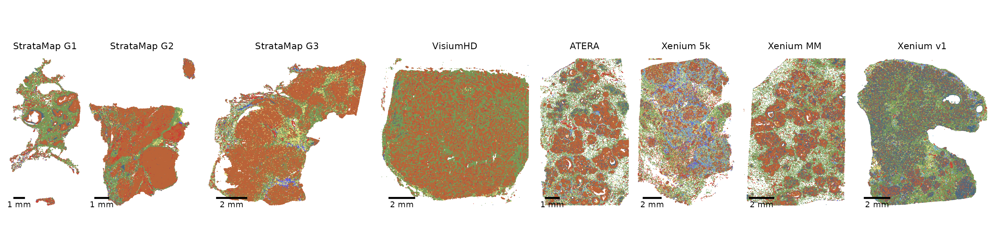
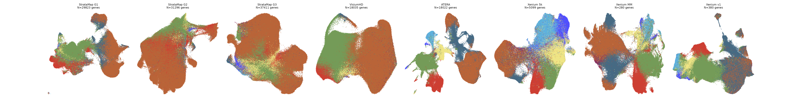
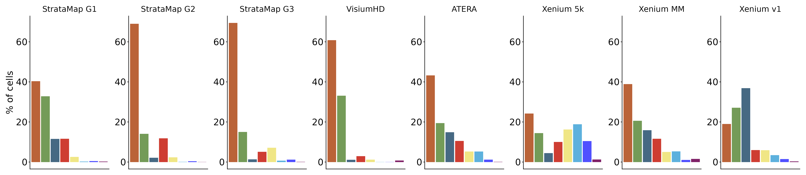
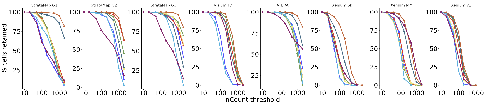
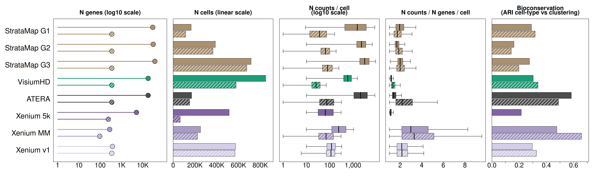
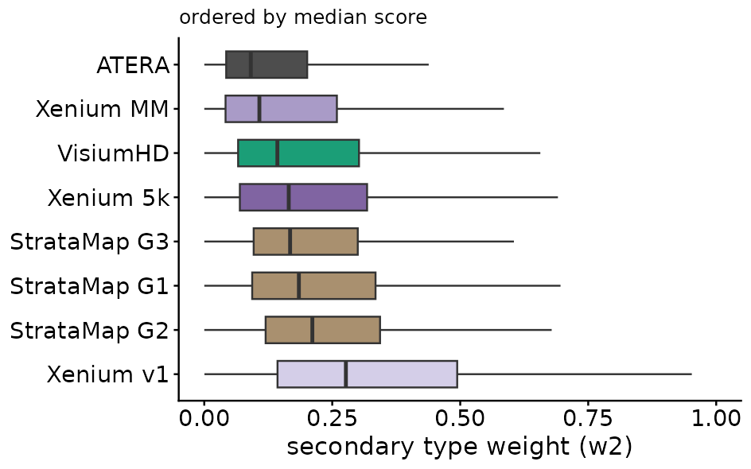
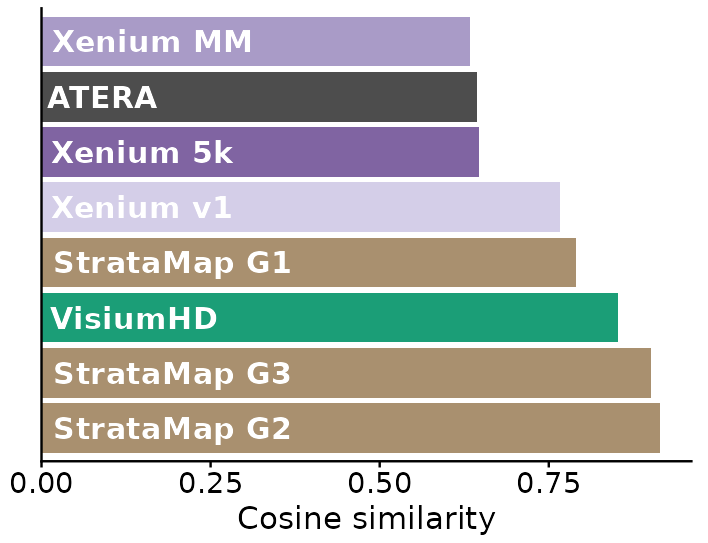
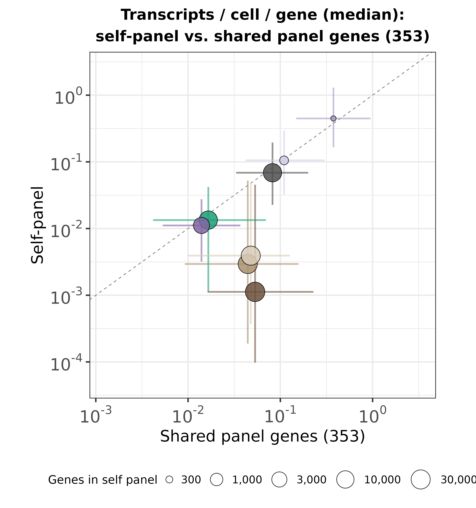

Spatial Transcriptomics Technology Comparison
================
Mariia Bilous

- [Overview](#overview)
  - [Pipeline](#pipeline)
- [Figure 1: Spatial distribution of cell
  types](#figure-1-spatial-distribution-of-cell-types)
- [Figure 2: Per-technology UMAP](#figure-2-per-technology-umap)
- [Figure 3: Cell-type composition per
  sample](#figure-3-cell-type-composition-per-sample)
- [Figure 4: Cell-type sensitivity to the nCount QC
  floor](#figure-4-cell-type-sensitivity-to-the-ncount-qc-floor)
- [Figure 5: Self vs. shared-panel-genes
  summary](#figure-5-self-vs-shared-panel-genes-summary)
- [Figure 6: RCTD secondary-type weight
  distribution](#figure-6-rctd-secondary-type-weight-distribution)
- [Figure 7: Spatial-neighborhood spillover (cosine
  similarity)](#figure-7-spatial-neighborhood-spillover-cosine-similarity)
- [Figure 8: Per-gene sensitivity, own panel vs. shared gene
  axis](#figure-8-per-gene-sensitivity-own-panel-vs-shared-gene-axis)

## Overview

Reproduces the 8 figures from [“Reproducing the Atera vs Stratamap
analysis”](https://lnkd.in/p/gHZ84RsX): 6 spatial transcriptomics
technologies (**StrataMap**, **VisiumHD**, **Atera**, **Xenium
MM/biomarkers**, **Xenium v1/breast+100**, **Xenium 5k**) on breast
cancer tissue - not one shared block, but largely different samples
entirely: Atera and Xenium MM/biomarkers are the only pair sharing a
tissue block; VisiumHD, Xenium v1/breast+100, and Xenium 5k are each
their own separate specimen; and StrataMap alone spans 3 different tumor
grades (DCIS/IDC Grade 1-3), each its own distinct sample. Every cell,
regardless of which sample or disease stage it came from, is annotated
against the same 10x Chromium Flex scRNA-seq reference via
[RCTD](https://doi.org/10.1038/s41587-021-00830-w) (Cable et al. 2022,
*Nature Biotechnology* - “Robust decomposition of cell type mixtures in
spatial transcriptomics”; doublet mode, class-aware, Level2), run
through [`rctd-py`](https://github.com/p-gueguen/rctd-py), a public
GPU-accelerated PyTorch reimplementation - not the original lab’s
private tooling.

### Pipeline

1.  **`00_download_raw_data.md`** - get the raw data.
2.  **`02_preprocess.sh`** - raw data -\> every intermediate artifact
    (QC, RCTD, embeddings, spatial metadata, spillover,
    composition/ARI/sensitivity summaries).
3.  **`03_generate_figures.sh`** - the 8 PNGs below.
4.  **This report** - narrates them, rendering from the PNG or its
    underlying CSV, whichever exists.

Each section names the `02_preprocess.sh` stage(s) and
`03_generate_figures.sh` command for that figure, then renders it: the
real PNG if it exists, otherwise a version rebuilt from its CSV.

------------------------------------------------------------------------

## Figure 1: Spatial distribution of cell types

One spatial plot per sample (all 8, fixed order: StrataMap grades 1-3,
VisiumHD, Atera, Xenium 5k, Xenium MM, Xenium v1), points colored by
RCTD `first_type`. This is the most direct look at whether each
technology recovers the tissue’s spatial organization (e.g. tumor
regions, stroma) at all, before any quantitative metric.

**To reproduce:** `02_preprocess.sh` STAGE 0-3 (ingestion, QC, RCTD)
then STAGE 5 (spatial metadata extraction) for all 8 samples, then:

``` bash
Rscript code/R/spatial_grid.R --out-dir results/figures/spatial --format png --dpi 300 \
  --point-size 0.3 --alpha 0.7 --panel-width 1.5 --panel-height 3 --out-name spatial_grid_all_bigdots_asp2
```



------------------------------------------------------------------------

## Figure 2: Per-technology UMAP

Each technology’s own UMAP (its full/native gene panel - “self”, not
restricted to any shared gene list), colored by `first_type`. This shows
whether cell-type structure is recoverable *in principle* for each
technology on its own terms, independent of any cross-technology gene
restriction.

**To reproduce:** `02_preprocess.sh` STAGE 0-3 then STAGE 4 (gene-set
embeddings, “self”/`all` set) for all 8 samples, then:

``` bash
Rscript code/R/umap_by_geneset.R --out-dir results/figures/umap    # per-sample umap_self_<tech>.png
Rscript code/R/umap_self_grid.R --out-dir results/figures/umap --out-name umap_self_grid_all
```



------------------------------------------------------------------------

## Figure 3: Cell-type composition per sample

Cell-type proportions per sample, cell types ordered by their overall
abundance summed across every sample (same order in every panel).

**To reproduce:** `02_preprocess.sh` STAGE 0-3, STAGE 5 (spatial
metadata), and STAGE 7 (`celltype_composition.R` - writes
`composition_summary.csv`, the CSV this figure and its fallback both
read), then:

``` bash
Rscript code/R/composition_grid.R --summary-csv results/composition/composition_summary.csv \
  --out-dir results/figures/composition/sorted_by_abundance
```



------------------------------------------------------------------------

## Figure 4: Cell-type sensitivity to the nCount QC floor

For every sample, what % of each cell type’s cells survive as the nCount
QC threshold is raised well above the pipeline’s actual default
(\>=10) - up to 2000. Cell types with naturally low RNA content lose a
disproportionate share of their cells as the floor rises; this figure
makes that bias visible per technology.

**To reproduce:** `02_preprocess.sh` STAGE 0-3 then STAGE 9
(`extract_count_distributions.R` - writes the per-sample
count-distribution parquets this figure reads;
`celltype_threshold_sensitivity.csv` itself is written by the plotting
command below, not by STAGE 9), then:

``` bash
Rscript code/R/celltype_threshold_sensitivity.R --extract-dir results/count_distributions \
  --out-dir results/figures/threshold_sensitivity --layout row_tall
```



------------------------------------------------------------------------

## Figure 5: Self vs. shared-panel-genes summary

Five panels sharing one technology axis: N genes, N cells, N counts per
cell, N counts/gene per cell, and bioconservation (ARI between
k-means-on-PCA clusters and RCTD `first_type`) - each comparing a
technology’s own full panel (“self”, solid) against the 353-gene panel
shared across every whole-transcriptome technology (“shared panel
genes”, hatched). This is the core “how much does restricting everyone
to the same gene axis change what you can resolve” figure.

Xenium 5k and Xenium MM don’t have a *native* shared-panel-genes
computation, so their hatched bar is a proxy: their own genes
intersected with the 380-gene breast+100 addon panel (`panel_genes`).
For Xenium MM this shrinks its 280-gene panel down to 96 genes; for
Xenium 5k, its ~5,100-gene panel down to 241. **Except** Xenium 5k’s
hatched bar is intentionally omitted from the
nCount/nCount-per-nGenes/ARI panels (panels 3-5): restricting its cells
to that 241-gene subset filters out enough of them
(`--min-count-in-subset`) that per-cell stats and clustering on the
remainder would be misleading. Xenium MM’s 96-gene subset (all real
signal, no filtering effect) doesn’t have this issue and keeps all 5
panels. N genes/N cells (panels 1-2) show both technologies’ proxy
either way, since those two numbers stay honest regardless of filtering.

**To reproduce:** `02_preprocess.sh` STAGE 0-4 (embeddings) then STAGE 8
(separation metric/ARI), STAGE 9 (count distributions), STAGE 10
(ngenes/ncells CSVs), and STAGE 11 (per-gene-set sensitivity), then:

``` bash
Rscript code/R/summary_grid_shared_panel.R \
  --ngenes-csv results/ngenes_ncells_barplot/ngenes_barplot.csv \
  --ncells-csv results/ngenes_ncells_barplot/ncells_barplot.csv \
  --overall-csv results/sensitivity/sensitivity_overall_all_technologies.csv \
  --ari-csv results/separation_ari/separation_ari_comparison.csv \
  --out-dir results/figures/summary_grid
```



------------------------------------------------------------------------

## Figure 6: RCTD secondary-type weight distribution

Per-sample distribution of RCTD’s doublet-mode `weight_second_type`
(“w2”), which represents the fraction of each cell’s expression profile
attributed to a second, distinct cell type. Higher w2 values indicate
greater profile impurity, as a larger proportion of the observed
expression is explained by a different cell type. Samples are ordered by
increasing median w2.

**To reproduce:** `02_preprocess.sh` STAGE 0-3 then STAGE 6
(`spillover.R` - writes the per-cell spillover cache), then:

``` bash
Rscript code/R/w2_boxplot.R --cache-root results/spillover_cache --out-dir results/figures/w2
```



------------------------------------------------------------------------

## Figure 7: Spatial-neighborhood spillover (cosine similarity)

For every sample: cosine similarity between each cell’s RCTD
`weight_second_type` and its spatial neighbors’ pooled second-type
weights, with a genuine permutation test (1000 shuffles of the
neighborhood term, one-sided p = fraction of shuffles \>= observed,
BH-corrected across the 8 samples). A high, significant cosine
similarity means secondary-type signal is spatially structured
(neighbors “agree” on which second type is bleeding in) rather than
random per-cell noise - evidence that at least part of w2 (figure 6)
reflects genuine spatial mixing/segmentation spillover, not just
per-cell annotation uncertainty.

**To reproduce:** same STAGE 6 spillover cache as figure 6, then:

``` bash
Rscript code/R/spillover_metrics.R --cache-root results/spillover_cache --out-dir results/figures/spillover
```



------------------------------------------------------------------------

## Figure 8: Per-gene sensitivity, own panel vs. shared gene axis

One point per technology: median transcript abundance (i.e., for each
gene, total gene counts normalized by total number of cells) on the
technology’s own full panel (y) vs. on the shared-panel axis (x),
log-scaled, with a dashed identity line and IQR error bars in both
directions. Point size reflects self panel size.

The shared-panel axis is the same literal 353-gene list for every
technology, but not every technology’s own panel actually contains all
353 of those genes: Atera, VisiumHD, Xenium v1, and StrataMap (all 3
grades) do (353/353); Xenium 5k’s panel only overlaps 229 of them, and
Xenium MM’s smaller targeted panel only 91. Those two points are still
the correct, literal intersection with the same 353-gene list - just a
smaller one, because their panels are smaller.

**To reproduce:** `02_preprocess.sh` STAGE 0-3, STAGE 5 (spatial
metadata, needed by `gene_sensitivity.R`), and STAGE 12 (per-gene
sensitivity + synthesis), then:

``` bash
Rscript code/R/gene_sensitivity_scatter.R \
  --stats-csv results/gene_sensitivity/gene_sensitivity_stats.csv --out-dir results/figures/gene_sensitivity_scatter
```


